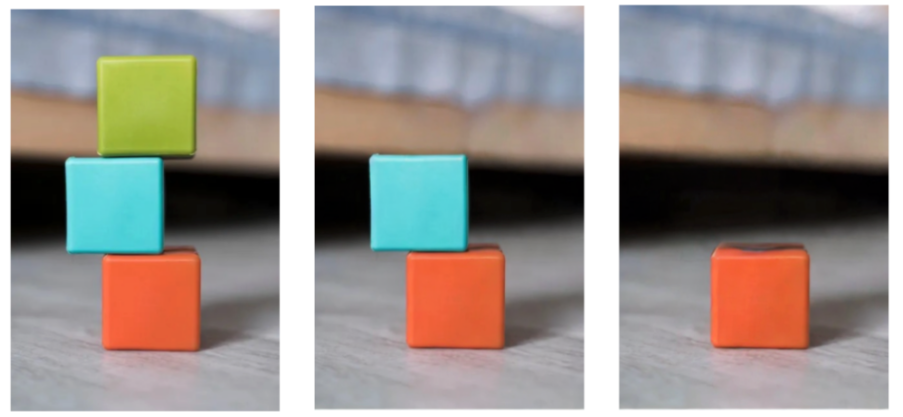

# Reproducibility Challenge : Visual Jenga

The objective of this repository is to reproduce and extend the results of this paper : [Visual Jenga: Discovering Object Dependencies via Counterfactual Inpainting](https://arxiv.org/pdf/2503.21770)

## Requirements

This challenge was done mostly using [Kaggle](https://www.kaggle.com/code) to run the notebooks, due to the large size of the models used. As such, this project is better suited for usage on Kaggle rather than on a local machine. 

## Training

One of the advantage of this challenge is that it only uses pre-trained models. You do not need training to reproduce it.

## Evaluation

To evaluate this model on Nyu-v2 and HardParse, upload the visual-jenga.ipynb notebook on Kaggle. In sessions options, choose GPU T4 x2 as accelerator. Pick the according dataset (Nyu-v2 or Hardparse) as a variable. Then run the notebook cell by cell.

**Warning** : The Nyu-v2 dataset is very large, testing the model on the entirety of it on Kaggle with GPU T4 x2 takes approximately 32 hours, which is more GPU time than Kaggle allows. We limited ourselves to 10% of it.

## Results

Our model achieves the following performance on Nyu-v2 and Hardparse :

| Model name         |     Nyu-V2      |    HardParse   |
| ------------------ |---------------- | -------------- |
| Visual Jenga       |     83.33%      |     57.50%     |

## Contributing

Distributed under MIT License.

If you wish to contribute further to this project, read the chapter 6.3 : Limitation of the current implementation on [Reproducibility Challenge : Visual Jenga](https://google.com).
